# Securing your infrastructure with Cloud Guard 

Cloud resources are growing and incredible rates. The raw number of resources to be examined and secured vastly overwhelm most information security teams with their existing processes and tooling. 

Cloud services growth continues to expand and customers need more help from their vendors to apply real security. Oracle alone provides >60 cloud applications and services by itself, and this can present an overwhelming challenge to customers.

Information Security needs are growing. Threats are expanding. More services means more knowledge required to secure them. And the gaps in skills and manpower continues to grow beyond the available expertise available. 

Oracle Cloud Guard is a unified security solution that provides a global and centralized approach to the protection of all of a customers’ assets.  It works to analyze data, detect threats and misconfigurations automatically, then hunt down and kill those security threats without requiring human oversight. Oracle Cloud Guard continuously collects data from every part of the infrastructure and application stack, including audit logs, Oracle Data Safe, Oracle OS Management Service, as well as third-party products. Oracle Cloud Guard proactively detects and stops anomalous activity it identifies, shutting down a malicious instance automatically, and proactively revoking user permissions when it detects anomalous user behavior. 

*Note: CloudGuard is currently in **Limited Availability**. Some of the futures such as automated remediation are disabled. In addition, some of the screens listed in here are subject to changes*

**IMPORTANT: As part of this lab, you will be switching between different users. You will use your SSO to manage Cloud Guard and the ephemeral Luna account to create a sanctioned resource. You will find messages on when you have to switch accounts as you move along the lab.**

## Module 1: Login to Cloud Guard

1. Open Firefox once your virtual desktop is fully loaded.

    

2. Open the OCI Console by clicking the **OCI CONSOLE** button.

    
    

3. Use your SSO credentials to login to the OCI console.

    ***IMPORTANT: You must log in with your SSO credentials. Luna ephemeral account does not has access to this service running at the tenant level.***

5. Once on the OCI console make sure that your region is set to Phoenix; change it otherwise. 
   
    

6. Open the general menu located at the left-hand side of the screen, click on **Security** and select **Cloud Guard**. Make sure that the console URL is set to phoenix as well. Use the following URL (https://console.us-phoenix-1.oraclecloud.com/cloud-guard/overview) to access the console directly. Keep in mind that every resource created as part of this lab, must remain within this region.
   
   

7. During the region swap, you might need to re-enter the tenant (**ospatraining2**) and click **Continue** to use your SSO to login to the console.

    

    

7. This is Oracle Cloud Guard dashboard. Here you will be able to identify threats and activities affecting your entire tenant or specific comparments. The Security Specialist can review deviations and take actions accordingly.

    

8. If you scroll down, you will be able to see the reponder status and whether you have any pending action.

    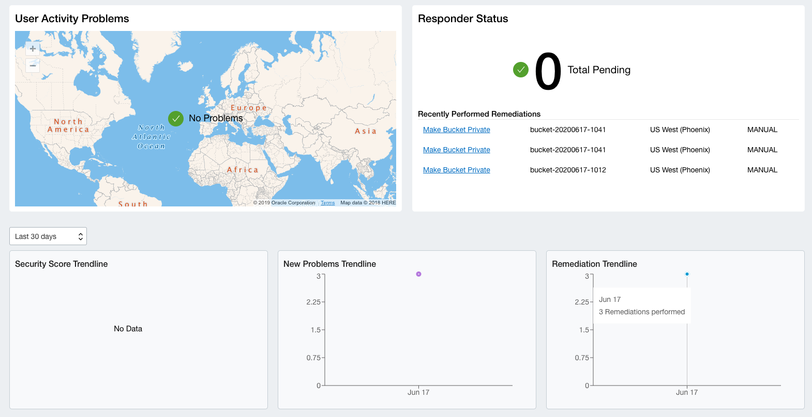 

## Module 2: Tailoring Detectors and Responders

1. We will need your compartment id to register a new target. You can get your comparment information by opening the **Luna-Lab.html** file located in the Luna desktop.
   
   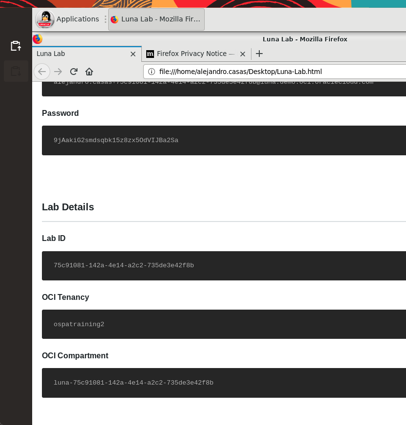

2. Now, You will create your own detector recipe. Make sure that you are at the root compartment and click **Detector Recipes** on the left menu.

    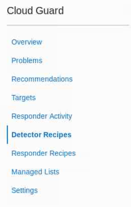
   
3. Click on the **Oracle Managed Configuration Recipe(Oracle Managed)**
   

4. Click **Clone**

   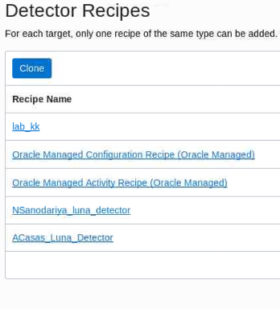
   
   
5. Provide a **Name** to the new detector recipe, a **Description**, make sure that you select your compartment *(Please refer to the previous steps on how to get your compartment information)*, and click **Clone**. We recommend the following name convention for your detector:

    ***[First Leter of your name and your last name]*_Luna_Detector** 
    
    

6. Now, You will create your own responder recipe. Make sure that you are at the root compartment and select **Responder Recipes**.
   
7. Click on the **Production Responder Recipe (Oracle Managed)**
   

8. Click **Clone**

   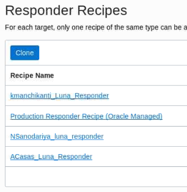

   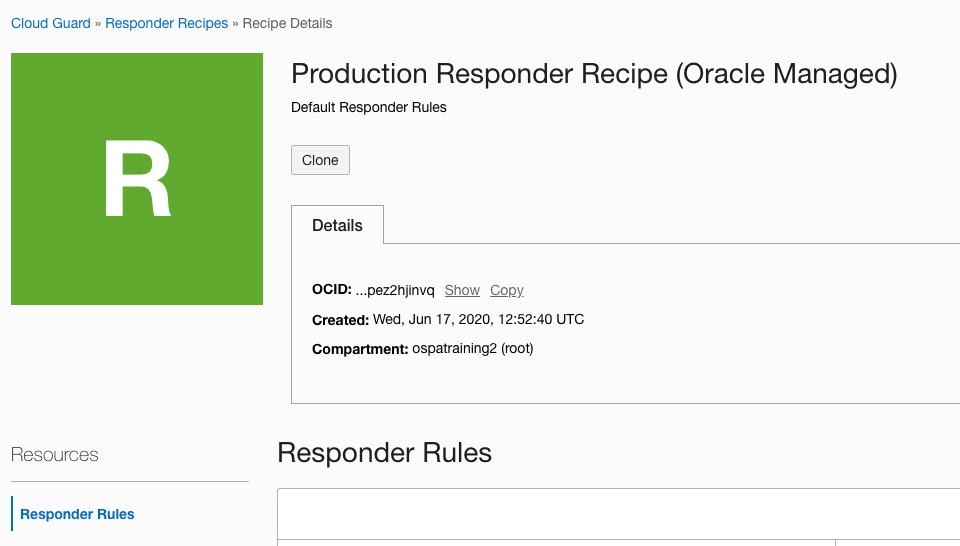

9.  Provide a **Name** to the new responder recipe, a **Description**, select your compartment *(Please refer to the previous steps on how to get your compartment information)*, and click **Clone**. We recommend the following name convention for your responder:

    ***[First Leter of your name and your last name]*_Luna_Detector** 

     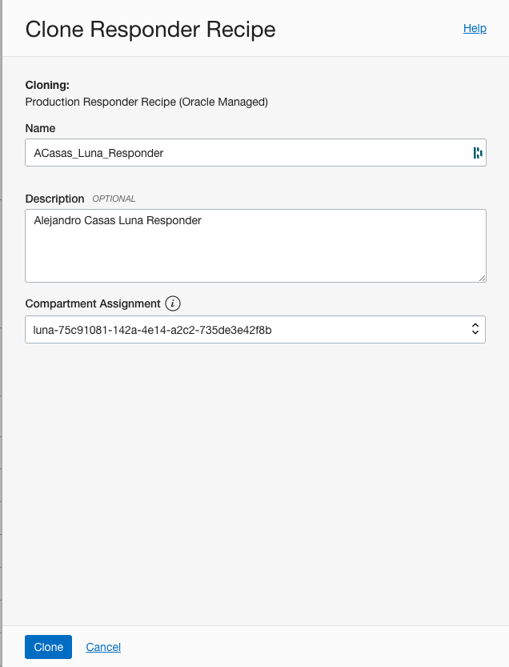

## Module 3: Registering a new target

1.  Login to Cloud Guard using your SSO Credentials. You can use the following URL instead (https://console.us-phoenix-1.oraclecloud.com/cloud-guard/overview) to access the console directly.
   
2.  Select **Targets** and click on **Create New Target**
   
    

3. Provide a **Target Name**, a Description, select your Luna Compartment *(Please refer to the previous steps on how to get your compartment information)*, Select the **Configuration Detector Recipe** created in the previous steps, Select the default **Activity Detector Recipe**, and finaly select the **Responder Recipe** created in the previous steps ass well. Click **Create**
We recommend the following name convention for your responder:
 ***CoSE_Luna_[First Leter of your name and your last name]***

    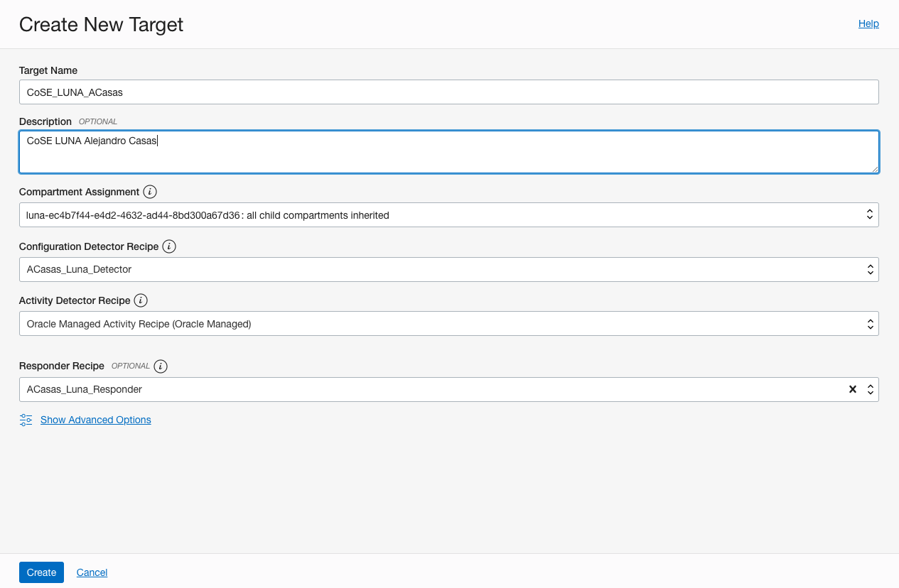

1. After the target is created you will be redirected to your target information. You can explore the settings. Once done, click the **Cloud Guard** Hyperlink located at the top left hand-side of the screen to get back to the main dashboard.
    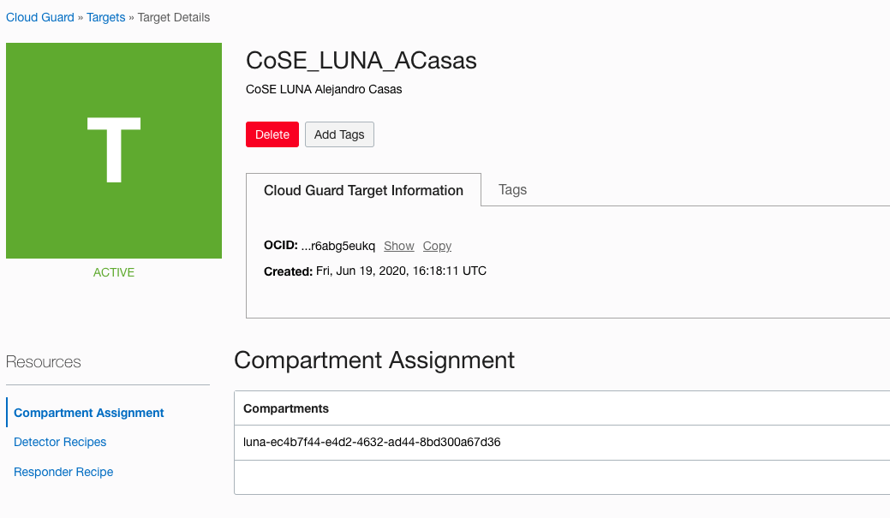

## Module 4: Creating a sanctioned resource

***IMPORTANT: Make sure that you close your browser and start over, or you are completely logout from OCI. We will use Luna Credentials to create the sanctioned resource.***

1. Open Firefox and open the OCI console. Make sure that you are completely logged out from OCI. 

    

2. Copy your Luna user id and password and log in to OCI with those credentials.

    

3. Make sure that you are working on Phoenix Region. You can use the following URL instead (https://console.us-phoenix-1.oraclecloud.com/) to access the console directly. Open the general menu located at the left-hand side of the screen, click on **Object Storage** and select **Object Storage**
   
   

4. Select your compartment and click **Create bucket**. *For further information about your compartment, you can open the Luna-Lab.html file located in your luna desktop.*
   
   

    *NOTE: If you are not able to open your Luna compartment, go to **Compute**,  **Instances** and select your compartment there and get back to Object Storage.* 

5. Enter a Bucket name and click **Creat Bucket**. For tracking purposes we recomend the following name convention:
   
    * bucket-CoSE-YourInitials 
  
    

6. Back on the buckets list, click on the bucket recently created
   
    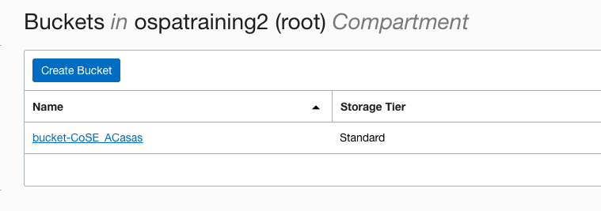

7. Review the information, and click on **Edit Visibility**
      
    

8.  Change the visility to **PUBLIC** and click **Save Changes**
    
    

9.  Now the bucket is publicly exposed. Don't worry, we will remediate this issue within the next minutes.

    

## Module 5: Executing remediation actions

***IMPORTANT: Make sure that you close your browser and start over, or you are completely logout from OCI. We will use SSO Credentials to create log in back as Cloud Guard administrator.***

1. Login back to **Cloud Guard** Console using your SSO credentials. Open the general menu located at the left-hand side of the screen, click on **Security** and select **Cloud Guard**. You can use the following URL instead (https://console.us-phoenix-1.oraclecloud.com/cloud-guard/overview) to access the console directly.
   
    

2. In the main dashboard you will see your environment status and current activities to be remediated. Considering that we have recently created a bucket, seeing the update in the console can take up to 10 minutes.

    

3. After a few minutes you will see the new alerts being reported. As you can see we can identify the issue rised by the setting in our bucket. You can click on **Problems** on the left-hand side of the screen to further investigate the issue.

    

4. As you can see, our Bucket public alert is listed as **High** risk level and not as **Critical** as configured by default on the Oracle Managed Detector list. 

    

5. Let's dig into the issue. Click on **Responder Activity** on the left-hand side of the screen. We can easily identify the issue, the resource and the execution status and type. Click on the problem name **Bucket is Public** link.
*Note: Due to Cloud Guard is in limited availability the automated response might be disable by the time of delivering this lab.* 

    

6. On this page we can see the details about the issue, risk level, status, resource and recommendations. As a Security Analyst you can mark this issue as resolved if you have manually remediated this tasks, or dismiss it if you consider this is a false postive. However; we know that this is a critical exposure, so let's fix it. Click on **Remediate** This will trigger an action and will restore the bucket to private. 

    

7. Review the actions and click **Remediate**

    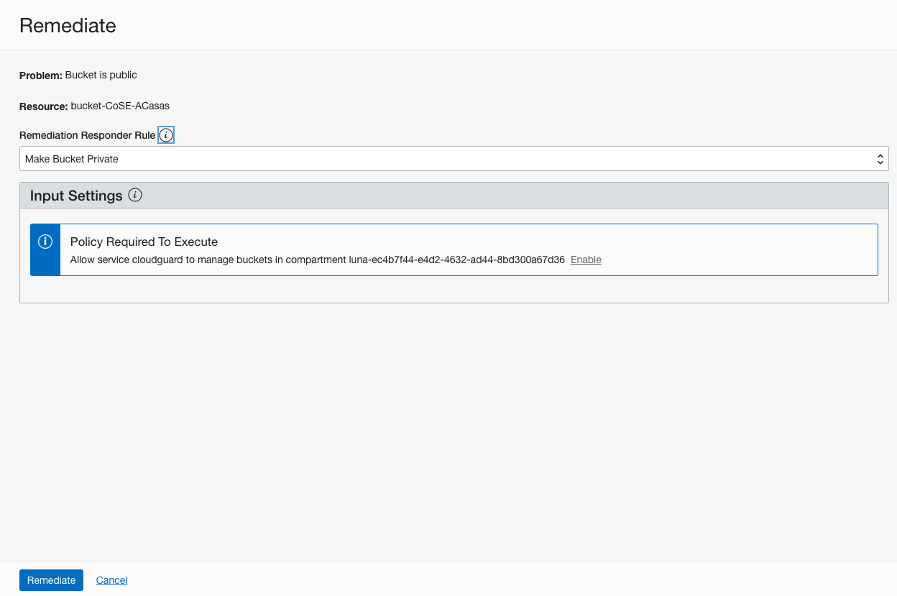

8. Finally, back to the **Cloud Guard** dashboard you will see that the action is now gone as remediated.

    

## Module 6: Verifying remediation actions

***IMPORTANT: Make sure that you close your browser and start over, or you are completely logout from OCI. We will use Luna Credentials to create the sanctioned resource.***

1. Open Firefox and open the OCI console. Make sure that you are working on Phoenix Region. You can use the following URL instead (https://console.us-phoenix-1.oraclecloud.com/) to access the console directly.

    

2. Copy your Luna user id and password and log in to OCI with those credentials.

    

3. Open the general menu located at the left-hand side of the screen, click on **Object Storage** and select **Object Storage**
   
   

4. Open the bucket that you have created, you will see it as private now.

    

******

**What you have done**

**Oracle Cloud Guard** is a unified security solution that provides a global and centralized approach to the protection of all of a customers’ assets.
As part of this lab you have navigated Cloud Guard console, tailored detectors and responders, enrolled new targets, identified deviations, and executed remediation actions. 

******
 