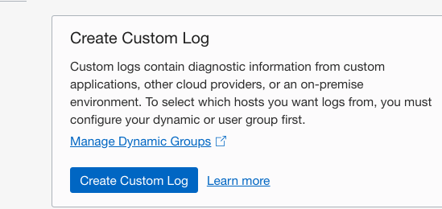
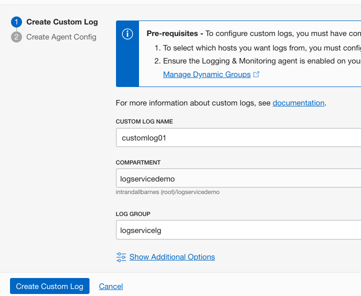
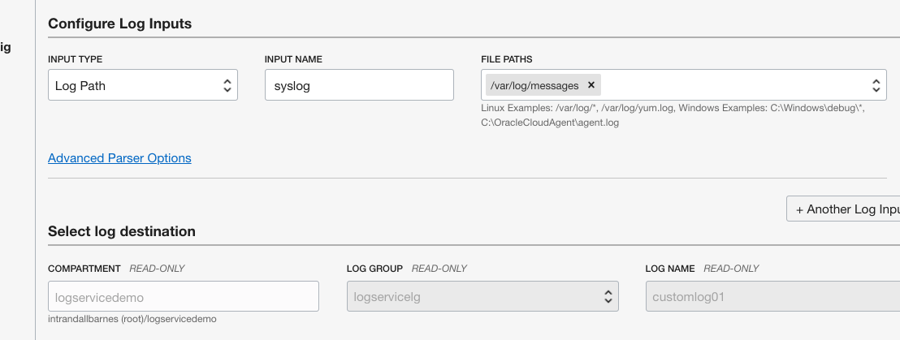
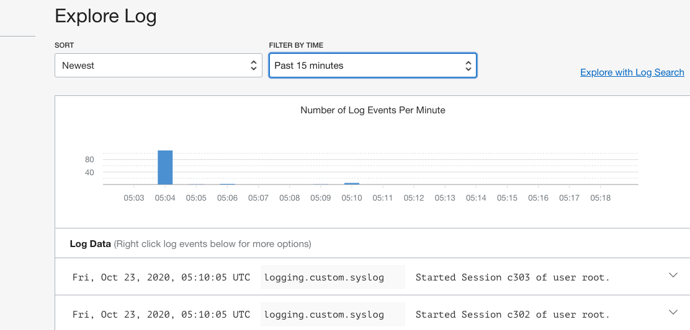

# Create Custom Application Logs

## Introduction

In this Lab you will create a custom log agent and use this to import log content real-time from the virtual machine created in Lab 1. 

Estimated Lab Time: 10 minutes

### About Product/Technology
Custom logs contain diagnostic information from custom applications, other cloud providers, or an on-premise environment.  OCI Logging Service makes it easy to ingest custom logs by providing an agent to extract, parse and upload logs directly to OCI.  The agent can be installed on many machines, and it pulls logs from local directories, where your apps or systems emit logs.  The agent may be installed and configured on machines outside of OCI.  However, to save time, in this Lab we will use the virtual machine created in Lab 1 since it is pre-configured with the agent already installed.

### Objectives

In this lab, you will:
* Create a Custom Log Agent Config
* Review Custom log data ingested by Logging Service

### Prerequisites

* An Oracle Free Tier, Always Free, Paid or LiveLabs Cloud Account
* Access to the cloud environment and resources configured in Lab 1
* The Log Group created in Lab 2

## **STEP 1**: Create a Custom Log Agent Config

An agent configuration provides instructions for both the Logging Service and a specific group of deployed agents to work together.  It is required for custom logs.  Follow these steps to create an agent configuration that will include importing syslog messages from our virtual machine created in Lab 1.

1. Open the navigation menu. Under Solutions and Platform, go to Logging, and then click Logs.  Under List Scope, Compartment, choose logservicedemo.  Select **Create Custom Log** to open the panel

    

   In **CUSTOM LOG NAME** enter customlog01, **COMPARTMENT** ensure logservicedemo is listed, and in **LOG GROUP** select logservicelg.  Click **Create Custom Log**.

    

   The **Create Agent Configuration** panel is displayed, where you can create a new configuration. 

    
  

   In **CONFIGURATION NAME** enter customconfig01.  Ensure **COMPARTMENT** specifies logservicedemo.  In **GROUP TYPE** select Dynamic Group, and in **GROUP** select the group created in Lab 1: logservicedg. 

    

   In the **Configure Log Inputs** section choose **INPUT TYPE** Log Path, **INPUT NAME**  syslog, and **FILE PATHS** /var/log/messages.  Although we are instructing the agent to process system generated logs, the same procedure may be used to select application log paths or entire log directories. 

    

   In this same section, click on **Advanced Parder Options** and choose **SYSLOG** in the **PARSER** list.  

    

   Click **Create** to complete the task.

## **STEP 2:** Review Log Data from Virtual Machine

It may take a few minutes for the configuration to propagate to local machine agents.  This is a good time to catch up on email or grab a coffee.  

1. Select the Custom Log (customlog01) we created in Step 1.

    
  
   This opens up the details panel.

2. Review the log properties and note the options to update the log and agent configuration.

    

   Explore log content, if already flowing into the Logging Service and avaialble for viewing.

    

  
You may proceed to the next lab.

## Learn More

## Acknowledgements
* **Author** - <Name, Title, Group>
* **Contributors** -  <Name, Group> -- optional
* **Last Updated By/Date** - <Name, Group, Month Year>

## Need Help?
Please submit feedback or ask for help using our [LiveLabs Support Forum](https://community.oracle.com/tech/developers/categories/livelabsdiscussions). Please click the **Log In** button and login using your Oracle Account. Click the **Ask A Question** button to the left to start a *New Discussion* or *Ask a Question*.  Please include your workshop name and lab name.  You can also include screenshots and attach files.  Engage directly with the author of the workshop.

If you do not have an Oracle Account, click [here](https://profile.oracle.com/myprofile/account/create-account.jspx) to create one.
